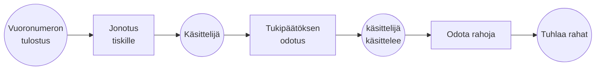
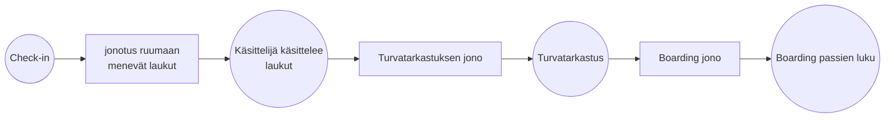

Kela-tukisimulaattori:

```mermaid
flowchart LR
    servicepoint((Vuoronumeron
tulostus))
servicepoint --> buffer2[Jonotus
tiskille]
buffer2 --> servicepoint2((Käsittelijä))
servicepoint2 --> buffer3[Tukipäätöksen
odotus]
buffer3 --> servicepoint3((käsittelijä
käsittelee))
servicepoint3--> buffer4[Odota rahoja]
buffer4--> servicepoint4((Tuhlaa rahat))

```
Lentokenttä

```mermaid
flowchart LR
    servicepoint5((Check-in))
servicepoint5 --> buffer2[jonotus ruumaan
menevät laukut]
buffer2 --> servicepoint6((Käsittelijä käsittelee
laukut))
servicepoint6 --> buffer3[Turvatarkastuksen jono]
buffer3 --> servicepoint7((Turvatarkastus))
servicepoint7--> buffer4[Boarding jono]
buffer4--> servicepoint8((Boarding passien luku))

```
